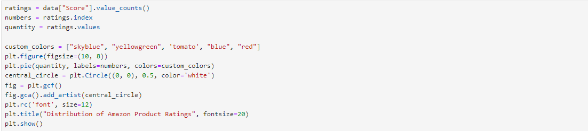
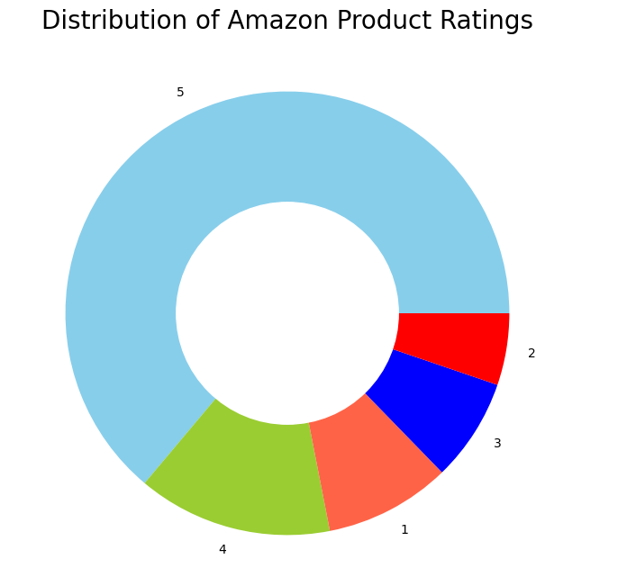
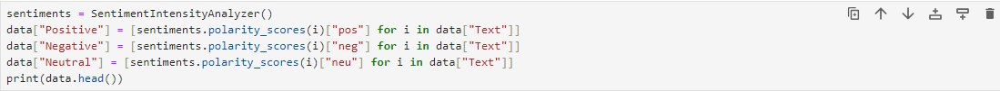
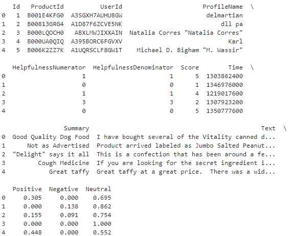
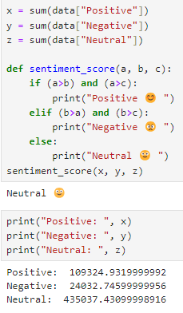

# Amazon-Product-Reviews-Sentiment-Analysis

## Overview

Amazon is an American multinational corporation that focuses on e-commerce, cloud computing, digital streaming, and artificial intelligence products. But it is mainly known for its e-commerce platform which is one of the biggest online shopping platforms today. There are so many customers buying products from Amazon that today Amazon earns an average of $ 638.1 million per day. So having such a large customer base, it will turn out to be an amazing data science project if we can analyze the sentiments of Amazon product reviews.

The dataset I’m using for the task of Amazon product reviews sentiment analysis was downloaded from Kaggle. This dataset contains the product reviews of over 568,000 customers who have purchased products from Amazon.

## Sentiment Analysis of Amazon Product Reviews

The Score column of this dataset contains the ratings that customers have given to the product based on their experience with the product.

According to the figure above, more than half of people rated products they bought from Amazon with 5 stars, which is good. Now, I’m going to add three more columns to this dataset as Positive, Negative, and Neutral by calculating the sentiment scores of the customer reviews mentioned in the Text column of the dataset:

So, most people are neutral when submitting their experiences with the products they have purchased from Amazon. So we can say that most of the reviews of the products available on Amazon are positive, as the total sentiment scores of Positive and Neural are much higher than Negative scores.

